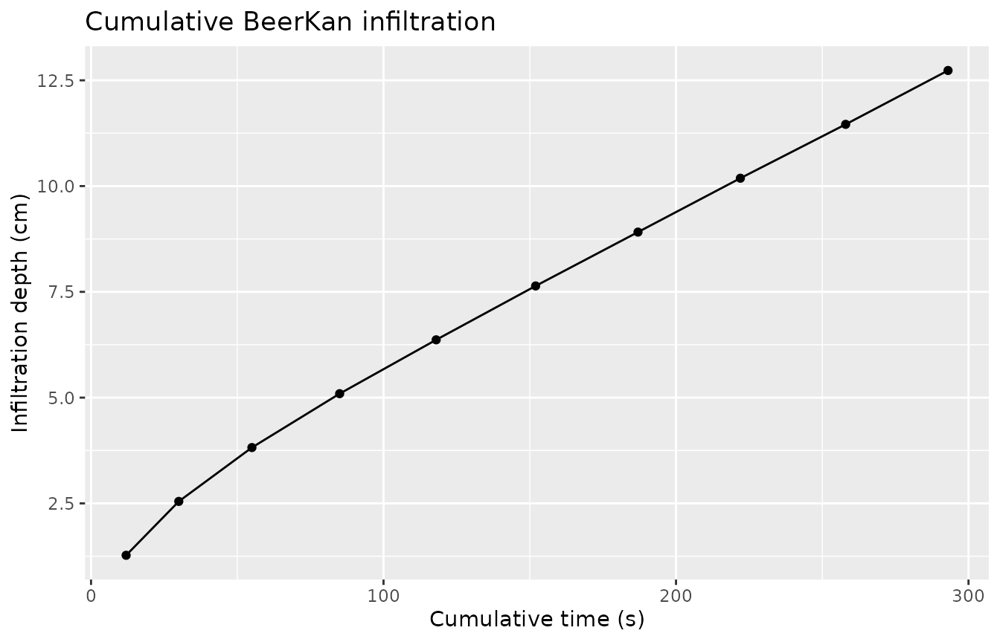

# BeerKan experiment and the BEST algorithm

``` r
library(tidysoilinfiltration)
library(dplyr)
library(tibble)
library(ggplot2)
```

## Overview

The **BeerKan** (Beerkan Estimation of Soil Transfer parameters)
protocol is a low-cost field method: a fixed volume of water is poured
repeatedly inside a ring, and the time for each pour to completely
infiltrate is recorded. Unlike standard ring or Minidisk methods,
measurement proceeds at **zero pressure head** (ponded).

The **BEST algorithm** (Lassabatère et al., 2006) fits the Haverkamp et
al. (1994) quasi-exact implicit infiltration model to the resulting I(t)
series, recovering both the **saturated hydraulic conductivity Ks** and
the **sorptivity S**. The Van Genuchten scale parameter **α** is then
recovered analytically.

| Step                          | Function                                                                                                      |
|-------------------------------|---------------------------------------------------------------------------------------------------------------|
| Pour events → cumulative I(t) | [`beerkan_cumulative()`](https://taakefyrsten.github.io/tidysoilinfiltration/reference/beerkan_cumulative.md) |
| VG shape params (n, α)        | `infiltration_vg_params(..., suction = 0)`                                                                    |
| Philip quick estimate         | [`fit_infiltration()`](https://taakefyrsten.github.io/tidysoilinfiltration/reference/fit_infiltration.md)     |
| BEST: Ks, S, α                | [`fit_best()`](https://taakefyrsten.github.io/tidysoilinfiltration/reference/fit_best.md)                     |

------------------------------------------------------------------------

## 1. Field data

A BeerKan run pours a fixed 100 mL of water 10 times into a ring (radius
5 cm), recording how long each pour takes to disappear.

``` r
run <- tibble(
  pour   = 1:10,
  volume = 100,                                     # mL per pour
  time   = c(12, 18, 25, 30, 33, 34, 35, 35, 36, 35)  # s to infiltrate
)
run
#> # A tibble: 10 × 3
#>     pour volume  time
#>    <int>  <dbl> <dbl>
#>  1     1    100    12
#>  2     2    100    18
#>  3     3    100    25
#>  4     4    100    30
#>  5     5    100    33
#>  6     6    100    34
#>  7     7    100    35
#>  8     8    100    35
#>  9     9    100    36
#> 10    10    100    35
```

The infiltration time increases early on (soil is initially dry) then
stabilises near 35 s as the soil approaches steady state.

------------------------------------------------------------------------

## 2. Cumulative infiltration

[`beerkan_cumulative()`](https://taakefyrsten.github.io/tidysoilinfiltration/reference/beerkan_cumulative.md)
accumulates both time and volume, then converts to depth using the ring
area.

``` r
cum <- beerkan_cumulative(run, volume_col = volume, time_col = time, radius = 5)
cum |> select(pour, volume, time, .cumulative_time, .infiltration)
#> # A tibble: 10 × 5
#>     pour volume  time .cumulative_time .infiltration
#>    <int>  <dbl> <dbl>            <dbl>         <dbl>
#>  1     1    100    12               12          1.27
#>  2     2    100    18               30          2.55
#>  3     3    100    25               55          3.82
#>  4     4    100    30               85          5.09
#>  5     5    100    33              118          6.37
#>  6     6    100    34              152          7.64
#>  7     7    100    35              187          8.91
#>  8     8    100    35              222         10.2 
#>  9     9    100    36              258         11.5 
#> 10    10    100    35              293         12.7
```

``` r
ggplot(cum, aes(x = .cumulative_time, y = .infiltration)) +
  geom_point() +
  geom_line() +
  labs(title = "Cumulative BeerKan infiltration",
       x = "Cumulative time (s)", y = "Infiltration depth (cm)")
```



The curve transitions from a rapid early phase to a linear steady-state,
consistent with the Haverkamp model.

------------------------------------------------------------------------

## 3. VG shape parameters from texture

For BEST we need the Van Genuchten shape parameter n. Since the
experiment runs at zero pressure head, use `suction = 0` to retrieve
only the shape parameters (`.A` will be `NA`, which is expected):

``` r
soil_meta <- tibble(texture = "loam", theta_s = 0.43, theta_i = 0.12) |>
  infiltration_vg_params(texture = texture, suction = 0)

soil_meta |> select(texture, theta_s, theta_i, .n, .alpha, .A)
#> # A tibble: 1 × 6
#>   texture theta_s theta_i    .n .alpha    .A
#>   <chr>     <dbl>   <dbl> <dbl>  <dbl> <dbl>
#> 1 loam       0.43    0.12  1.56  0.036    NA
```

------------------------------------------------------------------------

## 4. Philip quick estimate

Before running BEST, a quick Philip two-term fit gives a preliminary
sorptivity and conductivity proxy.

``` r
philip <- fit_infiltration(cum,
                           infiltration_col = .infiltration,
                           sqrt_time_col    = .sqrt_time)
philip
#> # A tibble: 1 × 5
#>     .C2    .C1 .C2_std_error .C1_std_error .convergence
#>   <dbl>  <dbl>         <dbl>         <dbl> <lgl>       
#> 1 0.343 0.0235        0.0298       0.00141 TRUE
```

C₁ (0.0235 cm/s) is a rough Ks proxy; BEST will refine this using the
full Haverkamp model.

------------------------------------------------------------------------

## 5. BEST algorithm

[`fit_best()`](https://taakefyrsten.github.io/tidysoilinfiltration/reference/fit_best.md)
accepts the cumulative I(t) data together with the soil moisture
parameters (theta_s, theta_i) and the VG shape exponent n.

``` r
best <- fit_best(
  cum,
  infiltration_col = .infiltration,
  time_col         = .cumulative_time,
  theta_s          = 0.43,
  theta_i          = 0.12,
  n                = soil_meta$.n
)
best
#> # A tibble: 1 × 7
#>      .Ks    .S .alpha .Ks_std_error .S_std_error .steady_n .convergence
#>    <dbl> <dbl>  <dbl>         <dbl>        <dbl>     <int> <lgl>       
#> 1 0.0360 0.261   1.24      0.000144      0.00215         4 TRUE
```

The key outputs:

| Parameter                        | Symbol | Value | Units    |
|----------------------------------|--------|-------|----------|
| Saturated hydraulic conductivity | Ks     | 0.036 | cm/s     |
| Sorptivity                       | S      | 0.261 | cm/s^0.5 |
| VG scale parameter               | α      | 1.24  | 1/cm     |

------------------------------------------------------------------------

## 6. Comparing BEST methods

Three fitting strategies are available. `"steady"` (default) uses the
last `steady_n = 4` points to define the steady-state window; `"slope"`
uses the early-time transient to estimate S independently.

``` r
methods <- c("steady", "slope", "intercept")

results <- lapply(methods, function(m) {
  fit_best(
    cum,
    infiltration_col = .infiltration,
    time_col         = .cumulative_time,
    theta_s = 0.43, theta_i = 0.12,
    n       = soil_meta$.n,
    method  = m
  ) |>
    mutate(method = m)
}) |>
  bind_rows()

results |> select(method, .Ks, .S, .alpha, .convergence)
#> # A tibble: 3 × 5
#>   method       .Ks    .S .alpha .convergence
#>   <chr>      <dbl> <dbl>  <dbl> <lgl>       
#> 1 steady    0.0360 0.261  1.24  TRUE        
#> 2 slope     0.0360 0.569  0.261 TRUE        
#> 3 intercept 0.0360 0.261  1.24  TRUE
```

------------------------------------------------------------------------

## 7. Multi-site workflow

For field campaigns, group by site and process all runs together.

``` r
# Per-site soil parameters are embedded as columns so fit_best() can resolve
# them via tidy evaluation within each group.
field_runs <- tibble(
  site    = rep(c("S1", "S2"), each = 10),
  pour    = rep(1:10, 2),
  volume  = 100,
  time    = c(
    12, 18, 25, 30, 33, 34, 35, 35, 36, 35,   # S1 — loam
     8, 11, 14, 17, 19, 20, 20, 21, 20, 21    # S2 — sandy loam (faster)
  ),
  theta_s = rep(c(0.43, 0.40), each = 10),
  theta_i = rep(c(0.12, 0.08), each = 10),
  n       = rep(c(1.56, 1.89), each = 10)
)

multi_cum <- field_runs |>
  group_by(site) |>
  beerkan_cumulative(volume_col = volume, time_col = time, radius = 5)

multi_best <- multi_cum |>
  group_by(site) |>
  fit_best(
    infiltration_col = .infiltration,
    time_col         = .cumulative_time,
    theta_s          = theta_s,
    theta_i          = theta_i,
    n                = n
  )

multi_best |> select(site, .Ks, .S, .alpha, .convergence)
#> # A tibble: 2 × 5
#>   site     .Ks    .S .alpha .convergence
#>   <chr>  <dbl> <dbl>  <dbl> <lgl>       
#> 1 S1    0.0360 0.261   1.24 TRUE        
#> 2 S2    0.0618 0.359   1.21 TRUE
```

Site S2 (sandy loam) shows higher Ks, consistent with its coarser
texture and faster infiltration times.

------------------------------------------------------------------------

## References

Haverkamp, R., Ross, P. J., Smettem, K. R. J., & Parlange, J.-Y. (1994).
Three-dimensional analysis of infiltration from the disc infiltrometer:
2. Physically based infiltration equation. *Water Resources Research*,
30(11), 2931–2935.

Lassabatère, L., Angulo-Jaramillo, R., Soria Ugalde, J. M., Cuenca, R.,
Braud, I., & Haverkamp, R. (2006). Beerkan estimation of soil transfer
parameters through infiltration experiments—BEST. *Soil Science Society
of America Journal*, 70(2), 521–532.
<https://doi.org/10.2136/sssaj2005.0026>
