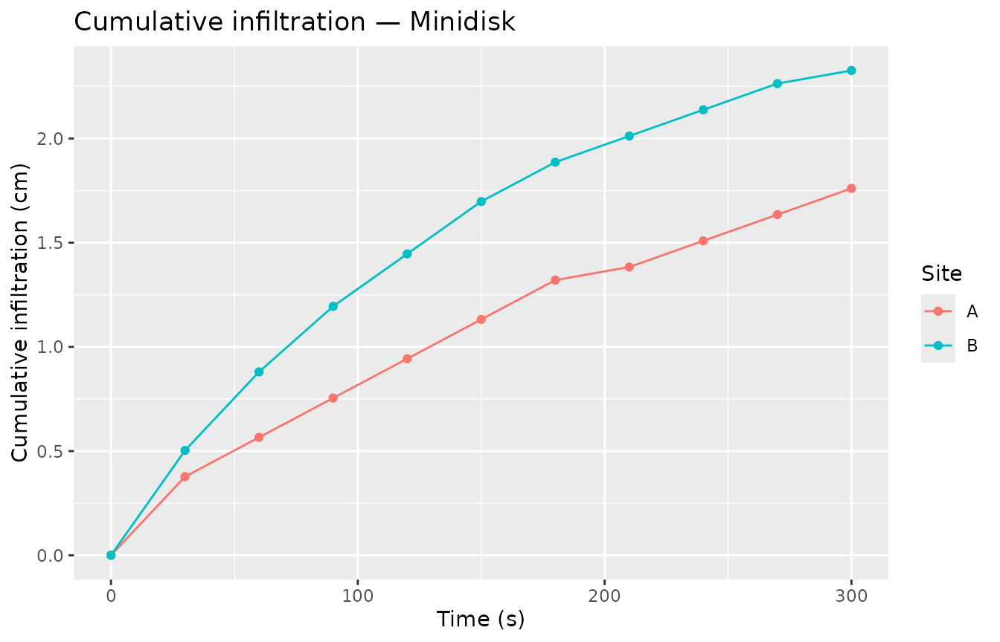

# Minidisk tension-disc infiltrometer workflow

``` r
library(tidysoilinfiltration)
library(dplyr)
library(tibble)
library(ggplot2)
```

## Overview

The Minidisk Infiltrometer (Decagon Devices) delivers water at a
controlled tension (suction) below saturation. The Zhang (1997) method
extracts the **unsaturated hydraulic conductivity K(h)** from a two-step
analysis:

1.  Fit the Philip (1957) two-term polynomial to cumulative infiltration
    to recover the conductivity proxy C₁.
2.  Divide C₁ by the soil-specific shape parameter A (derived from Van
    Genuchten parameters and the applied tension) to get K(h).

[`minidisk_conductivity()`](https://taakefyrsten.github.io/tidysoilinfiltration/reference/minidisk_conductivity.md)
wraps steps 2 in a single call, giving a four-step pipeline from raw
field readings to K(h):

| Step                      | Function                                                                                                                |
|---------------------------|-------------------------------------------------------------------------------------------------------------------------|
| Raw readings → I(t)       | [`infiltration_cumulative()`](https://taakefyrsten.github.io/tidysoilinfiltration/reference/infiltration_cumulative.md) |
| Philip two-term fit → C₁  | [`fit_infiltration()`](https://taakefyrsten.github.io/tidysoilinfiltration/reference/fit_infiltration.md)               |
| VG lookup + K(h) = C₁ / A | [`minidisk_conductivity()`](https://taakefyrsten.github.io/tidysoilinfiltration/reference/minidisk_conductivity.md)     |

The underlying functions
[`infiltration_vg_params()`](https://taakefyrsten.github.io/tidysoilinfiltration/reference/infiltration_vg_params.md),
[`parameter_A_zhang()`](https://taakefyrsten.github.io/tidysoilinfiltration/reference/parameter_A_zhang.md),
and
[`hydraulic_conductivity_minidisk()`](https://taakefyrsten.github.io/tidysoilinfiltration/reference/hydraulic_conductivity_minidisk.md)
remain exported for cases that need more control.

------------------------------------------------------------------------

## 1. Single-site example

A typical Minidisk run records the reservoir volume (mL) at fixed time
intervals. The disc radius is 2.25 cm (the standard instrument).

``` r
raw <- tibble(
  time   = seq(0, 300, 30),   # seconds
  volume = c(95, 89, 86, 83, 80, 77, 74, 73, 71, 69, 67)  # mL
)
```

The full pipeline from raw readings to K(h):

``` r
result <- raw |>
  infiltration_cumulative(time = time, volume = volume) |>
  fit_infiltration(.infiltration, .sqrt_time) |>
  minidisk_conductivity(texture = "sandy loam", suction = 2)

result |> select(.C1, .n, .alpha, .A, .K_h)
#> # A tibble: 1 × 5
#>       .C1    .n .alpha    .A     .K_h
#>     <dbl> <dbl>  <dbl> <dbl>    <dbl>
#> 1 0.00252  1.89  0.075  3.91 0.000645
```

K(h) ≈ 6.45^{-4} cm/s at 2 cm tension for this sandy loam sample.

------------------------------------------------------------------------

## 2. Multi-site workflow

For field campaigns with multiple samples, group by site before
[`infiltration_cumulative()`](https://taakefyrsten.github.io/tidysoilinfiltration/reference/infiltration_cumulative.md).
Because grouping is now preserved through cumulative calculations, only
one [`group_by()`](https://dplyr.tidyverse.org/reference/group_by.html)
is needed for the whole pipeline.

``` r
multi <- tibble(
  site   = rep(c("A", "B"), each = 11),
  time   = rep(seq(0, 300, 30), 2),
  volume = c(
    95, 89, 86, 83, 80, 77, 74, 73, 71, 69, 67,   # site A — sandy loam
    95, 87, 81, 76, 72, 68, 65, 63, 61, 59, 58    # site B — loamy sand
  )
)

# Per-site metadata (texture, suction)
meta <- tibble(
  site    = c("A", "B"),
  texture = c("sandy loam", "loamy sand"),
  suction = c(2, 2)
)
```

``` r
multi_result <- multi |>
  group_by(site) |>
  infiltration_cumulative(time = time, volume = volume) |>
  fit_infiltration(.infiltration, .sqrt_time) |>
  left_join(meta, by = "site") |>
  minidisk_conductivity(texture = texture, suction = suction)

multi_result |> select(site, texture, .C1, .A, .K_h)
#> # A tibble: 2 × 5
#>   site  texture        .C1    .A     .K_h
#>   <chr> <chr>        <dbl> <dbl>    <dbl>
#> 1 A     sandy loam 0.00252  3.91 0.000645
#> 2 B     loamy sand 0.00137  2.43 0.000565
```

------------------------------------------------------------------------

## 3. Analytical A with `method = "zhang"`

For non-standard disc radii or suction levels outside the Decagon table,
pass `method = "zhang"` to compute A analytically from Zhang (1997)
rather than looking it up. The `radius` argument is only used in this
mode.

``` r
multi |>
  group_by(site) |>
  infiltration_cumulative(time = time, volume = volume) |>
  fit_infiltration(.infiltration, .sqrt_time) |>
  left_join(meta, by = "site") |>
  minidisk_conductivity(texture = texture, suction = suction,
                        method = "zhang", radius = 2.25) |>
  select(site, texture, .A, .K_h)
#> # A tibble: 2 × 4
#>   site  texture       .A     .K_h
#>   <chr> <chr>      <dbl>    <dbl>
#> 1 A     sandy loam  3.82 0.000660
#> 2 B     loamy sand  4.21 0.000326
```

The analytical A values will differ slightly from the tabulated ones —
both approaches are valid; the choice depends on whether your suction
and radius match the Decagon reference conditions.

------------------------------------------------------------------------

## 4. Visualisation

``` r
multi |>
  group_by(site) |>
  infiltration_cumulative(time = time, volume = volume) |>
  ggplot(aes(x = time, y = .infiltration, colour = site)) +
  geom_point() +
  geom_line() +
  labs(
    title  = "Cumulative infiltration — Minidisk",
    x      = "Time (s)",
    y      = "Cumulative infiltration (cm)",
    colour = "Site"
  )
```



------------------------------------------------------------------------

## References

Decagon Devices, Inc. (2005). *Mini Disk Infiltrometer User’s Manual*.

Philip, J. R. (1957). The theory of infiltration: 4. Sorptivity and
algebraic infiltration equations. *Soil Science*, 84(3), 257–264.

Zhang, R. (1997). Determination of soil sorptivity and hydraulic
conductivity from the disk infiltrometer. *Soil Science Society of
America Journal*, 61(4), 1024–1030.
<https://doi.org/10.2136/sssaj1997.03615995006100060008x>
