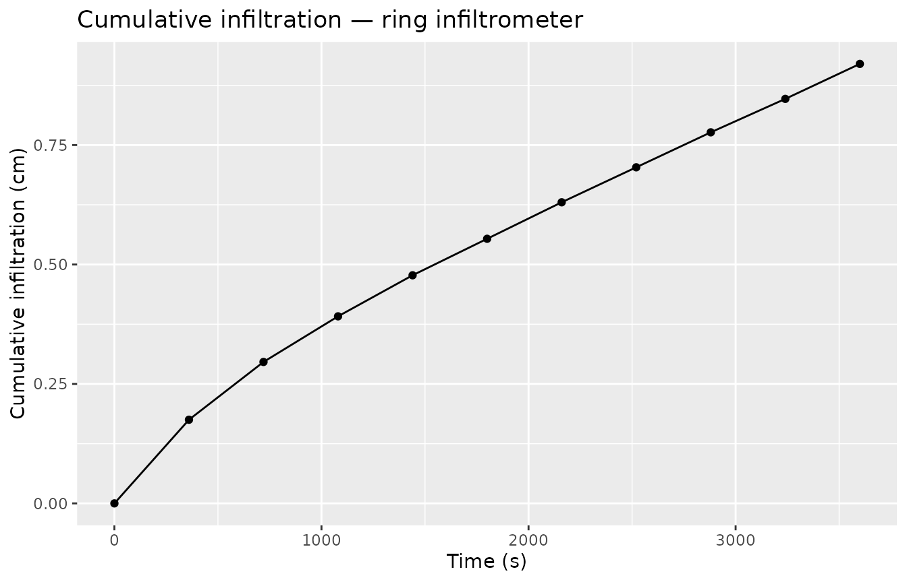
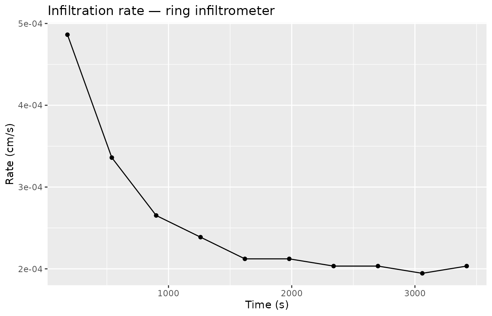
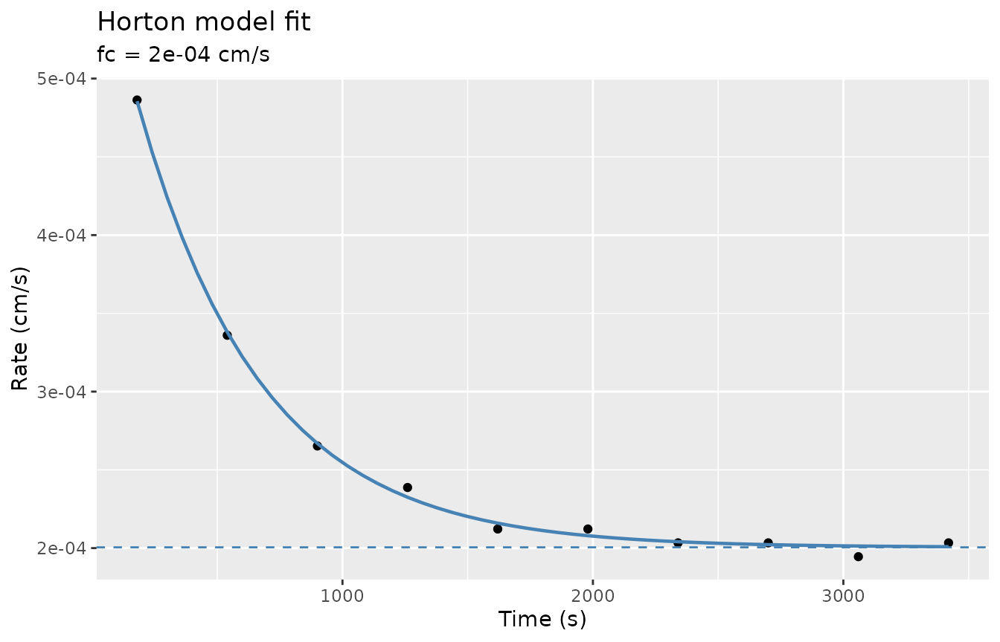

# Ponded ring infiltration workflow

``` r
library(tidysoilinfiltration)
library(dplyr)
library(tibble)
library(ggplot2)
```

## Overview

Standard ponded ring infiltrometers (single- or double-ring) measure how
fast water infiltrates at saturation. Three empirical models are
available:

| Model                  | Function                                                                                                                      | Ksat estimate?            | Notes                      |
|------------------------|-------------------------------------------------------------------------------------------------------------------------------|---------------------------|----------------------------|
| Philip (1957) two-term | [`fit_infiltration()`](https://taakefyrsten.github.io/tidysoilinfiltration/reference/fit_infiltration.md)                     | C₁ ≈ Ksat at steady state | Linearisable; fast         |
| Horton (1940)          | [`fit_infiltration_horton()`](https://taakefyrsten.github.io/tidysoilinfiltration/reference/fit_infiltration_horton.md)       | fc ≈ Ksat                 | Requires rates; NLS fit    |
| Kostiakov (1932)       | [`fit_infiltration_kostiakov()`](https://taakefyrsten.github.io/tidysoilinfiltration/reference/fit_infiltration_kostiakov.md) | No                        | Purely empirical power law |

The processing pipeline is:

1.  [`infiltration_cumulative()`](https://taakefyrsten.github.io/tidysoilinfiltration/reference/infiltration_cumulative.md)
    — convert volume readings to I(t)
2.  [`infiltration_rate()`](https://taakefyrsten.github.io/tidysoilinfiltration/reference/infiltration_rate.md)
    — compute interval rates (for Horton)
3.  Fit one or more models to the resulting series

------------------------------------------------------------------------

## 1. Field data

A 10 cm radius ring measured over one hour, reading the reservoir volume
(mL) every six minutes.

``` r
ring_raw <- tibble(
  time   = seq(0, 3600, 360),   # seconds (0 – 60 min)
  volume = c(500, 445, 407, 377, 350, 326, 302, 279, 256, 234, 211)  # mL
)
ring_raw
#> # A tibble: 11 × 2
#>     time volume
#>    <dbl>  <dbl>
#>  1     0    500
#>  2   360    445
#>  3   720    407
#>  4  1080    377
#>  5  1440    350
#>  6  1800    326
#>  7  2160    302
#>  8  2520    279
#>  9  2880    256
#> 10  3240    234
#> 11  3600    211
```

## 2. Cumulative infiltration and rates

``` r
ring <- ring_raw |>
  infiltration_cumulative(time = time, volume = volume, radius = 10) |>
  infiltration_rate(time_col = time, infiltration_col = .infiltration)

ring |> select(time, .infiltration, .rate, .time_mid)
#> # A tibble: 11 × 4
#>     time .infiltration     .rate .time_mid
#>    <dbl>         <dbl>     <dbl>     <dbl>
#>  1     0         0     NA               NA
#>  2   360         0.175  0.000486       180
#>  3   720         0.296  0.000336       540
#>  4  1080         0.392  0.000265       900
#>  5  1440         0.477  0.000239      1260
#>  6  1800         0.554  0.000212      1620
#>  7  2160         0.630  0.000212      1980
#>  8  2520         0.703  0.000203      2340
#>  9  2880         0.777  0.000203      2700
#> 10  3240         0.847  0.000195      3060
#> 11  3600         0.920  0.000203      3420
```

The first `.rate` row is `NA` — there is no preceding interval for the
initial observation.

``` r
ggplot(ring, aes(x = time, y = .infiltration)) +
  geom_point() +
  geom_line() +
  labs(title = "Cumulative infiltration — ring infiltrometer",
       x = "Time (s)", y = "Cumulative infiltration (cm)")
```



``` r
ring |>
  filter(!is.na(.rate)) |>
  ggplot(aes(x = .time_mid, y = .rate)) +
  geom_point() +
  geom_line() +
  labs(title = "Infiltration rate — ring infiltrometer",
       x = "Time (s)", y = "Rate (cm/s)")
```



------------------------------------------------------------------------

## 3. Philip two-term fit

``` r
philip <- fit_infiltration(ring,
                           infiltration_col = .infiltration,
                           sqrt_time_col    = .sqrt_time)
philip
#> # A tibble: 1 × 5
#>       .C2      .C1 .C2_std_error .C1_std_error .convergence
#>     <dbl>    <dbl>         <dbl>         <dbl> <lgl>       
#> 1 0.00764 0.000129      0.000336    0.00000509 TRUE
```

C₁ (1.29^{-4} cm/s) is a proxy for Ksat under ponded conditions; C₂
(0.00764 cm/s^0.5) is the sorptivity proxy.

------------------------------------------------------------------------

## 4. Horton model

The Horton (1940) model fits an exponential decay to the infiltration
rate series:

$$f(t) = f_{c} + \left( f_{0} - f_{c} \right) \cdot e^{- kt}$$

where fc ≈ Ksat.

``` r
horton <- fit_infiltration_horton(ring,
                                  rate_col = .rate,
                                  time_col = .time_mid)
horton
#> # A tibble: 1 × 7
#>        .fc     .f0      .k .fc_std_error .f0_std_error .k_std_error .convergence
#>      <dbl>   <dbl>   <dbl>         <dbl>         <dbl>        <dbl> <lgl>       
#> 1 0.000200 6.11e-4 0.00202    0.00000209    0.00000947    0.0000757 TRUE
```

The Horton estimates: fc = 2^{-4} cm/s ≈ Ksat, f0 = 6.11^{-4} cm/s
(initial rate), k = 0.002025 s⁻¹ (decay constant).

Visualise the fitted curve:

``` r
# Predicted rate curve over the observed time range
t_pred <- seq(180, 3420, 60)
pred_horton <- tibble(
  time = t_pred,
  rate = horton$.fc + (horton$.f0 - horton$.fc) * exp(-horton$.k * t_pred)
)

ring |>
  filter(!is.na(.rate)) |>
  ggplot(aes(x = .time_mid, y = .rate)) +
  geom_point() +
  geom_line(data = pred_horton, aes(x = time, y = rate),
            colour = "steelblue", linewidth = 0.8) +
  geom_hline(yintercept = horton$.fc, linetype = "dashed", colour = "steelblue") +
  labs(title    = "Horton model fit",
       subtitle = paste0("fc = ", signif(horton$.fc, 3), " cm/s"),
       x = "Time (s)", y = "Rate (cm/s)")
```



------------------------------------------------------------------------

## 5. Kostiakov model

The Kostiakov (1932) power model fits cumulative infiltration:

$$I(t) = a \cdot t^{b}\qquad(a > 0,\ 0 < b < 1)$$

Note that the Kostiakov model does not approach a finite steady-state
rate, so it cannot provide a Ksat estimate.

``` r
kostiakov <- fit_infiltration_kostiakov(ring,
                                        infiltration_col = .infiltration,
                                        time_col         = time)
kostiakov
#> # A tibble: 1 × 5
#>        .a    .b .a_std_error .b_std_error .convergence
#>     <dbl> <dbl>        <dbl>        <dbl> <lgl>       
#> 1 0.00269 0.712     0.000120      0.00570 TRUE
```

------------------------------------------------------------------------

## 6. Multi-site workflow

Group the raw data by site and fit all three models in a single pipeline
using
[`group_by()`](https://dplyr.tidyverse.org/reference/group_by.html).

``` r
multi_ring <- tibble(
  site   = rep(c("Field_1", "Field_2"), each = 11),
  time   = rep(seq(0, 3600, 360), 2),
  volume = c(
    500, 445, 407, 377, 350, 326, 302, 279, 256, 234, 211,   # loam
    500, 404, 349, 308, 271, 237, 202, 168, 134, 100,  66    # sandy loam
  )
)

# Cumulative + rate in one pass
multi_cum <- multi_ring |>
  group_by(site) |>
  infiltration_cumulative(time = time, volume = volume, radius = 10) |>
  infiltration_rate(time_col = time, infiltration_col = .infiltration)

# Philip fit
multi_philip <- multi_cum |>
  group_by(site) |>
  fit_infiltration(infiltration_col = .infiltration,
                   sqrt_time_col    = .sqrt_time)
multi_philip
#> # A tibble: 2 × 6
#>   site        .C2      .C1 .C2_std_error .C1_std_error .convergence
#>   <chr>     <dbl>    <dbl>         <dbl>         <dbl> <lgl>       
#> 1 Field_1 0.00764 0.000129      0.000336    0.00000509 TRUE        
#> 2 Field_2 0.0128  0.000166      0.000547    0.00000829 TRUE

# Horton fit
multi_horton <- multi_cum |>
  group_by(site) |>
  fit_infiltration_horton(rate_col = .rate, time_col = .time_mid)
multi_horton |> select(site, .fc, .f0, .k, .convergence)
#> # A tibble: 2 × 5
#>   site         .fc      .f0      .k .convergence
#>   <chr>      <dbl>    <dbl>   <dbl> <lgl>       
#> 1 Field_1 0.000200 0.000611 0.00202 TRUE        
#> 2 Field_2 0.000301 0.00124  0.00301 TRUE
```

------------------------------------------------------------------------

## References

Horton, R. E. (1940). An approach toward a physical interpretation of
infiltration capacity. *Soil Science Society of America Proceedings*, 5,
399–417.

Kostiakov, A. N. (1932). On the dynamics of the coefficient of
water-percolation in soils. *Transactions of the 6th Commission of the
International Society of Soil Science*, Part A, 17–21.

Philip, J. R. (1957). The theory of infiltration: 4. Sorptivity and
algebraic infiltration equations. *Soil Science*, 84(3), 257–264.
